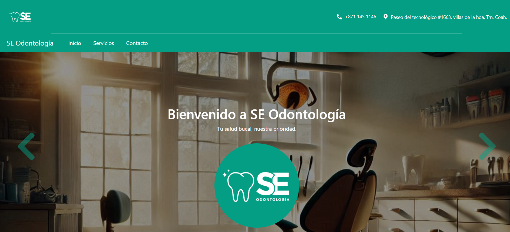
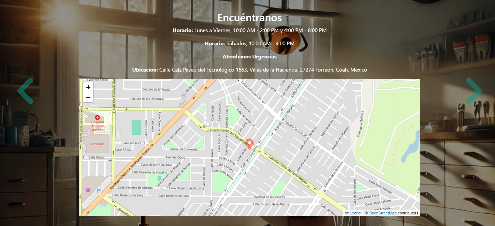
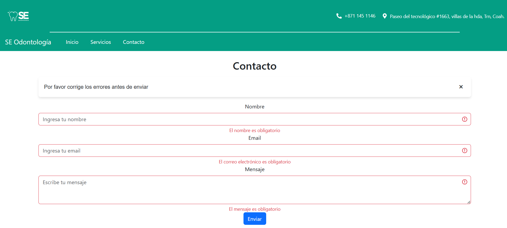
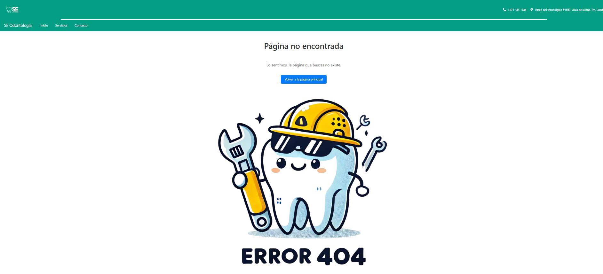
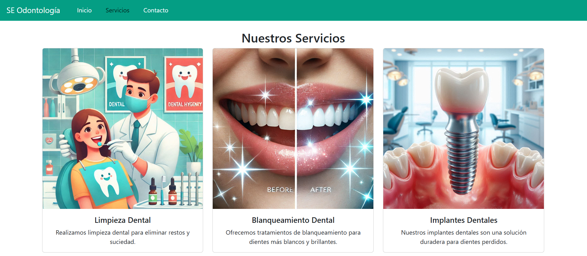
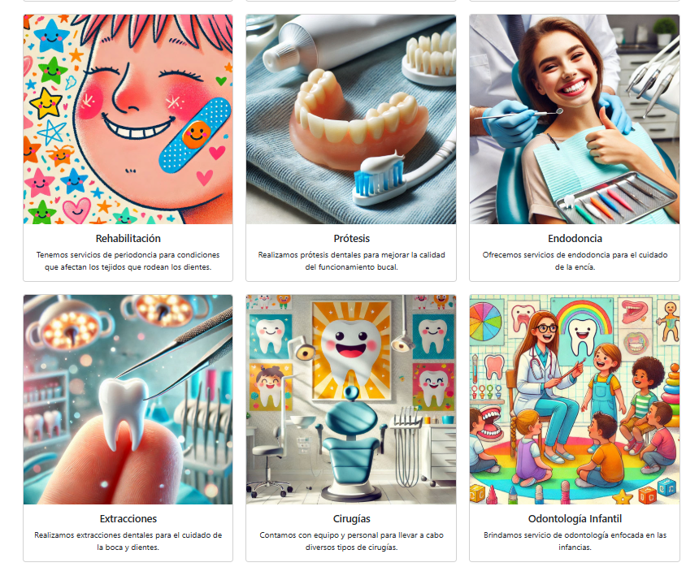
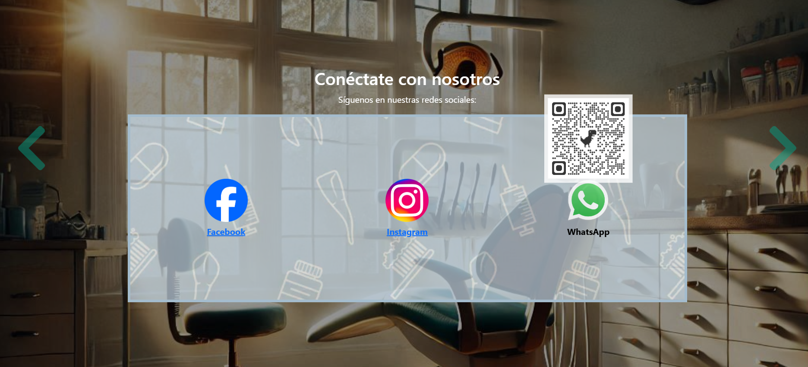

# 🏥 Clínica SE Odontología - Página Web

🚀 Proyecto de una página web para **Clínica SE Odontología**, diseñado para proporcionar información sobre los servicios odontológicos, ubicación y contacto.

---

## 📜 Descripción General
Esta página web permite a los pacientes conocer nuestros servicios, ubicar nuestra clínica en el mapa y agendar citas en línea. Aun se encuentra en desarrollo con lenguaje y tecnología de: **HTML, CSS, JavaScript y React**.

---

## 🎨 Capturas de Pantalla
### 🌟 Página de Inicio


### 📍 Ubicación de la Clínica


### 🦷 Otros







🎥 **Video de presentación**
### 🌟 Sección de Inicio
[](https://youtu.be/3lQkPgW_EUQ)

### 🌟 Otras Secciones
[](https://youtu.be/xONhUH-PPEo)

---


## 📂 Estructura del Proyecto
```
📦 OdontoClinica
├── 📂 media
│   ├── 📂 public
│   │   ├── 📂 images
│   │   │   ├── 📂 Icons
│   │   │   │   ├── Red-marker.png
│   │   │   ├── 📂 Logos
│   │   │   │   ├── Facebook.png
│   │   │   │   ├── Instagram.png
│   │   │   │   ├── SELogo.jpg
│   │   │   │   ├── Whatsapp.png
│   │   │   │   ├── WhatsappQR.png
│   │   │   ├── 📂 ServiceList
│   │   │   │   ├── Blanqueamiento.png
│   │   │   │   ├── Cirugia.png
│   │   │   │   ├── Endodoncia.png
│   │   │   │   ├── Extracciones.png
│   │   │   │   ├── Implante.png
│   │   │   │   ├── Limpieza.png
│   │   │   │   ├── OdontologiaInfantil.png
│   │   │   │   ├── Ortodoncia.png
│   │   │   │   ├── Ortopedia.png
│   │   │   │   ├── Periodoncia.png
│   │   │   │   ├── Protesis.png
│   │   │   │   ├── Rehabilitacion.png
│   │   │   ├── Background.jpg
│   │   │   ├── Error404.png
│   │   │   ├── SuperBackground.png
│   │   ├── favicon.ico
│   │   ├── index.html
│   │   ├── logo192.png
│   │   ├── logo512.png
│   │   ├── manifest.json
│   │   ├── robots.txt
├── 📂 src
│   ├── 📂 app
│   │   ├── App.css
│   │   ├── App.test.js
│   │   ├── index.js
│   │   ├── logo.svg
│   ├── 📂 components
│   │   ├── 📂 Alert
│   │   │   ├── Alert.css
│   │   │   ├── index.js
│   │   ├── 📂 Contacto
│   │   │   ├── index.js
│   │   ├── 📂 Header
│   │   │   ├── header.css
│   │   │   ├── index.js
│   │   ├── 📂 HomeSlider
│   │   │   ├── HomeSlider.css
│   │   │   ├── index.js
│   │   ├── 📂 Map
│   │   │   ├── Map.css
│   │   │   ├── index.js
│   │   ├── 📂 NotFound
│   │   │   ├── NotFound.css
│   │   │   ├── index.js
│   │   ├── 📂 ServiceList
│   │   │   ├── index.js
│   │   ├── 📂 TopHeader
│   │   │   ├── TopHeader.css
│   │   │   ├── index.js
│   ├── 📂 context
│   │   ├── context.js
│   ├── 📂 hooks
│   │   ├── validations.js
│   ├── 📂 pages
│   │   ├── 📂 Contact
│   │   │   ├── index.js
│   │   ├── 📂 Home
│   │   │   ├── index.js
│   │   ├── 📂 NotFound
│   │   │   ├── index.js
│   │   ├── 📂 Services
│   │   │   ├── index.js
│   ├── index.css
│   ├── index.js
│   ├── reportWebVitals.js
│   ├── setupTests.js
├── .gitignore
├── README.md
├── package-lock.json
├── package.json

```
---

## ⚙️ Tecnologías Usadas
✅ **Frontend:** HTML, CSS, JavaScript  
✅ **Framework:** React  
✅ **Mapas:** Leaflet.js  

---

## 📦 Instalación y Uso

1. **Clona el repositorio:**
   ```sh
   git clone https://github.com/LuisEstrad/OdontoClinica.git
   ```
2. **Ingresa a la carpeta del proyecto:**
   ```sh
   cd OdontoClinica
   ```
3. **Abre el archivo en el navegador:**
   - Si usas Live Server en VS Code, haz clic en "Go Live".
   - Si prefieres manualmente, abre `index.html`.

---

## 💡 Características Principales
✅ Diseño responsivo y adaptable.  
✅ Integración con **Leaflet.js** para mostrar la ubicación.  
✅ Formulario de contacto con validación y envío de correos con **EmailJS**.  
✅ Galería de imágenes.  

---

## 📬 Contacto
👨‍💻 **Desarrollador:** Luis Ángel Mata Estrada 
✉️ **Email:** luis.matae@outlook.com  
📞 **Teléfono:** 8123910618

This section has moved here: [https://facebook.github.io/create-react-app/docs/deployment](https://facebook.github.io/create-react-app/docs/deployment)

### `npm run build` fails to minify

This section has moved here: [https://facebook.github.io/create-react-app/docs/troubleshooting#npm-run-build-fails-to-minify](https://facebook.github.io/create-react-app/docs/troubleshooting#npm-run-build-fails-to-minify)
